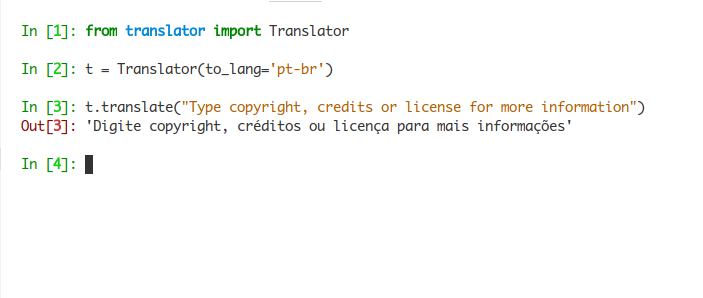

# ztranslator

Simples tradutor de linha de comando, com mymemory.translated.net por trás. Você também pode usá-lo como um módulo python no seu código, também pode configurar uma combinação de tecla de atalho no seu sistema para que execute o ztranlator.



## Instalação:

```sh
$ pip install ztranslator
```

## Exemplos de uso:

#### Na linha de comando:

```sh
$ ztranslator --help
```

```sh
$ python -m translator --help
```

####Como um módulo python:

```python
In [1]: from translator import Translator

In [2]: t = Translator(to_lang='pt-br')

In [3]: t.translate("Type copyright, credits or license for more information")
Out[3]: 'Digite copyright, créditos ou licença para mais informações'
```

## Configuração para Desenvolvimento

```sh
$ git clone https://github.com/andreztz/ztranslator.git
$ virtualenv venv
$ pip install PyGObject==3.30.1
$ source venv/bin/activate
$ python setup.py develop
```

## Histórico de lançamento

-   0.0.4 - O primeiro lançamento adequado.
    -   Trabalho em andamento

André Santos – [@ztzandre](https://twitter.com/ztzandre) – andreztz@gmail.com

[https://github.com/andreztz/ztranslator](https://github.com/andreztz/)

## Contribua

1. Fork it (<https://github.com/andreztz/ztranslator/fork>)
2. Create your feature branch (`git checkout -b feature/fooBar`)
3. Commit your changes (`git commit -am 'Add some fooBar'`)
4. Push to the branch (`git push origin feature/fooBar`)
5. Create a new Pull Request
